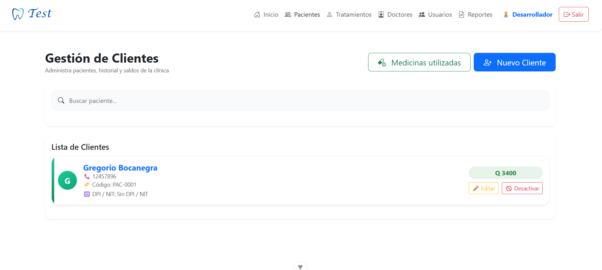
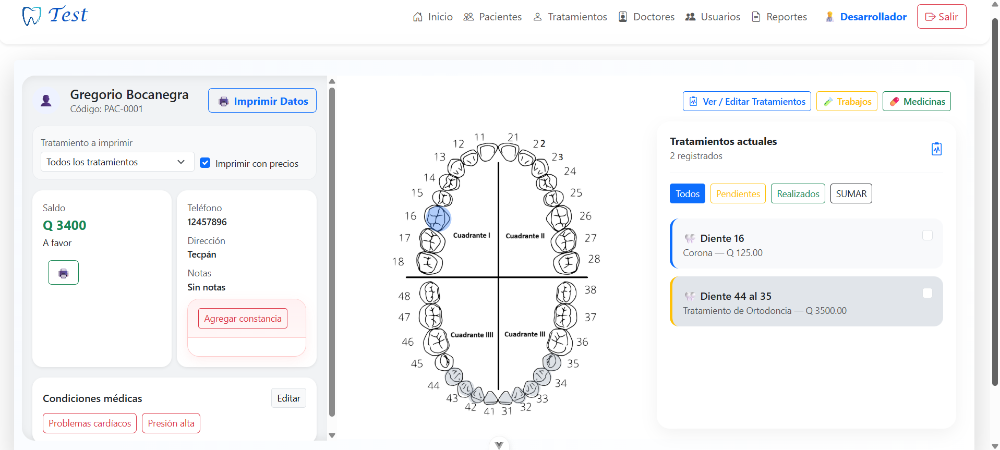
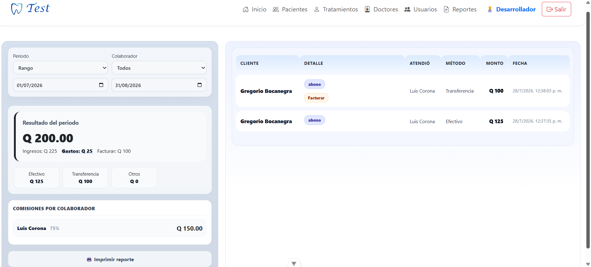

# Sistema de Gestión Clínica Odontológica

Aplicación web desarrollada con **Vue.js y Firebase** para la gestión administrativa, clínica y financiera de una clínica odontológica.

El sistema centraliza la información de pacientes, tratamientos con odontograma de cada paciente, movimientos financieros, doctores, permisos y reportes dentro de una aplicación web responsiva.

## Tecnologías utilizadas

- Vue.js
- JavaScript
- Vite
- Firebase Authentication
- Cloud Firestore
- Firebase Cloud Functions
- Firebase Hosting
- Progressive Web App (PWA)
- HTML
- CSS

## Funcionalidades principales

### Gestión de pacientes
- Registro y actualización de pacientes
- Datos personales y clínicos
- Historial de movimientos
- Consulta de saldo
- Notas y observaciones

### Odontograma y tratamientos
- Selección de piezas dentales
- Registro de tratamientos por diente
- Tratamientos generales
- Estado de tratamientos
- Control de precios

### Gestión financiera
- Registro de cargos y abonos
- Control de ingresos y egresos
- Métodos de pago
- Control de montos pendientes
- Generación de reportes financieros

### Gestión de doctores
- Registro de doctores
- Asignación de tratamientos
- Control de comisiones
- Reportes por profesional

### Usuarios y seguridad
- Firebase Authentication
- Roles de usuario
- Permisos administrativos
- Control de acceso a funcionalidades
- Cloud Functions para operaciones administrativas

### Reportes
- Reportes por día, semana, mes o rango de fechas
- Ingresos y gastos
- Métodos de pago
- Comisiones
- Información para impresión

## Estructura del proyecto

```text
clinica-dental/
│
├── src/
│   ├── components/
│   ├── views/
│   ├── router/
│   ├── firebase.js
│   └── main.js
│
├── functions/
│   ├── index.js
│   └── package.json
│
├── public/
├── firebase.json
├── package.json
├── vite.config.js
└── .env.example

```

## Capturas del sistema



### Gestión de pacientes


### Reporte financiero

